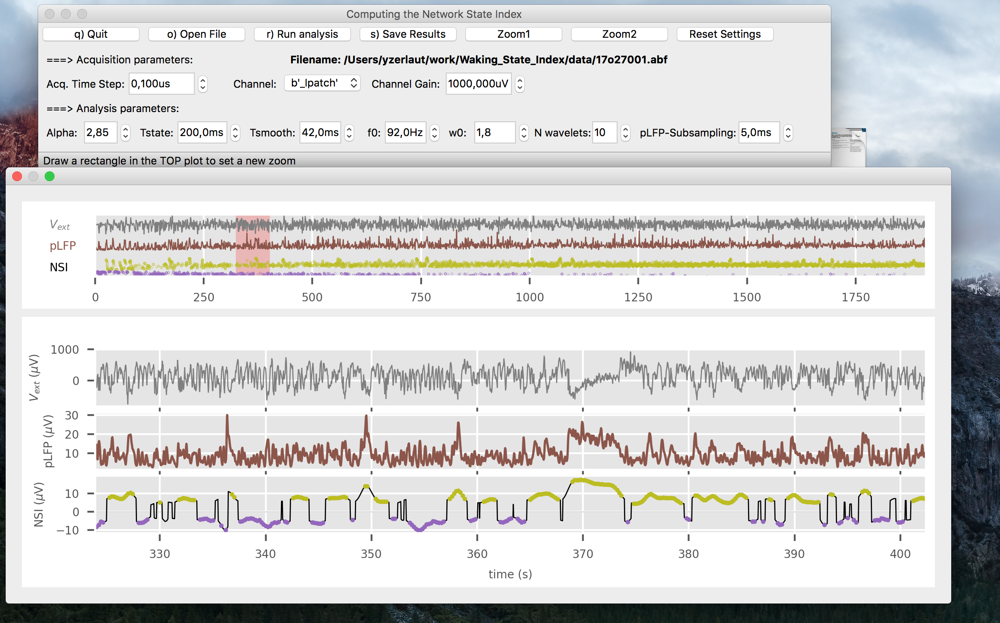

# Identifying Network State from Extracellular Recordings during Wakefulness in Neocortex

Implements a quantitative characterization of network states in neocortex from the signal recorded by an extracellular electrode.

[The source for the implementation is available here][src].

See the paper details about the method.

----

## Dependencies

- [Python 3][python], [Numpy][numpy], [Scipy][scipy]
- [Neo][neo] to be able to load electrophysiological data
- [PyQT][pyqt] for the Graphical User Interface (GUI), -- optional --

----

## Installation

- Install a scientific python distribution (the [Anaconda version][anaconda] is a very good one). Choose the Python 3 version. It contains [Numpy][numpy] and [Scipy][scipy].

- Install PyQT5: open the terminal (or the MsWin Command Prompt) and run:
```
pip install PyQT5
```

- Install Neo: open the terminal (or the MsWin Command Prompt) and run:
```
pip install neo
```

- Download the present code
  1) If you have git
  ```
	git clone https://github.com/yzerlaut/Waking_State_Index.git
  ```

  2) If you don't, download the zip archive: [https://github.com/yzerlaut/Waking_State_Index/archive/master.zip] and extract it.

----

## Run the program
  Open the terminal (or the MsWin Command Prompt)
  
  ```
  cd path_where_you_have_extracted_or_cloned_the_archive/Waking_State_Index/ # replace 'cd' by 'chdir' on MSWin
  
  python src/gui.py
  ```

----

## GUI Screenshot



## GUI features

### Load data:

##### Electrophysiological data supported

- Axon Instruments (pClamp) ".abf" format

- HDF5 ".h5" format

- Numpy storing formats (".npz" storing a dictionary)

You can set the desired channel to analyze and the gain that should be applied (only if you want it in uV)

### Run analysis:

It computes the NSI measure over the whole data.
It can be a bit long if the data are large.

### Visualize the data and the output of the NSI analysis

In the top 3 plots, we show the full (subsampled) data.

In the bottom 3 plots, we show a zoomed (subsampled) portion of the data. Highlighted with a red filled rectangle in the top plot. 

### Zoom :

- Zoom1: When clicking on this button, you can select a time window in the top plot
- Zoom2: When clicking on this button, you can select a time window in the bottom-Vext plot

### Save the output of the analysis:

The output is stored as an hdf5 datafile.
It containes the sample times of validated network states and their associated NSI level.


[packaging guide]: https://packaging.python.org
[distribution tutorial]: https://packaging.python.org/en/latest/distributing.html
[src]: https://github.com/yzerlaut/waking_state_index
[rst]: http://docutils.sourceforge.net/rst.html
[md]: https://tools.ietf.org/html/rfc7764#section-3.5 "CommonMark variant"
[md use]: https://packaging.python.org/specifications/core-metadata/#description-content-type-optional
[anaconda]: https://www.anaconda.com/download
[numpy]: https://www.numpy.org
[scipy]: https://www.scipy.org
[neo]: http://neuralensemble.org/neo/
[pyqt]: https://www.riverbankcomputing.com/software/pyqt/intro
[python]: https://docs.python.org